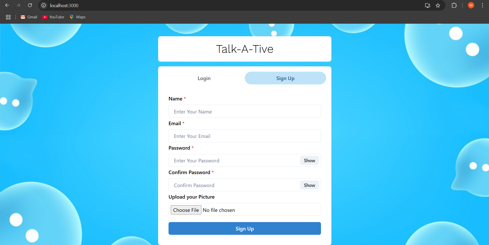

# 💬 Chat Website

A real-time chat web application built using modern web technologies. Users can register, log in, and communicate in public or private chat rooms with seamless messaging.

---

## 🚀 Features

- 🔐 User authentication (Sign Up / Login)
- 💬 Real-time chat functionality
- 👥 One-on-one and group chat support
- 🧾 Message history
- 📱 Responsive design (mobile-friendly)

---

## 🛠 Tech Stack

**Frontend:**

- React Js
- Chakra UI
- JavaScript

**Backend:**

- Node.js
- Express.js
- Socket.io (for real-time messaging)

**Database:**

- MongoDB (with Mongoose)

---

## 📸 Screenshots



---

## 📁 Folder Structure

```
FSD_PROJECT/
├── backend/                 # Backend code (Node.js + Express)
│   ├── config/              # DB and environment configurations
│   ├── controllers/         # Request/response logic
│   ├── data/                # Sample data or static content
│   ├── middleware/          # Custom middlewares (auth, error handling)
│   ├── models/              # Mongoose models/schemas
│   ├── routes/              # API route definitions
│   ├── server.js            # Main entry point for backend server
│   └── .gitignore
│
├── frontend/                # Frontend code (React)
│   ├── node_modules/        # Installed npm packages (auto-generated)
│   ├── public/              # Static public files (HTML, icons, etc.)
│   └── src/                 # React source code
│       ├── animations/      # Animation-related assets
│       ├── components/      # Reusable UI components
│       ├── config/          # Frontend configurations or constants
│       ├── Context/         # Global state/context API logic
│       ├── Pages/           # Page-level components/routes
│       ├── App.js           # Main app component
│       ├── App.css          # Global styling
│       ├── background.png   # Background image asset
│       ├── index.js         # Entry point for React app
│       └── index.css        # Base CSS styles
```

# How to run Project

```
cd backend
npm install

cd ../frontend
npm install

cd ../backend
npm start

cd ../frontend
npm start
```
